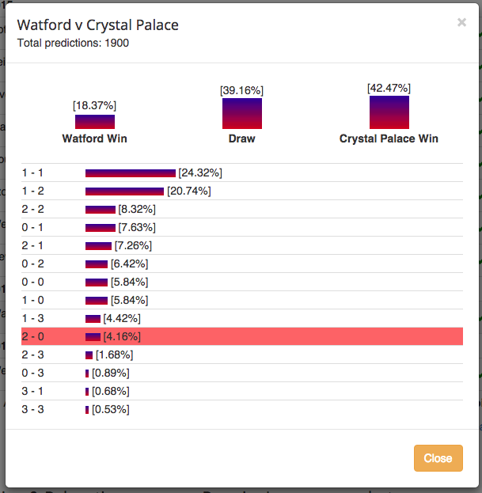

# ShearerBot
A program to make my predictions for "Predict the Premiership"

On the web: http://www.predictthepremiership.com/profile/index/30978

Latest Predictions:

Week = 19

2015-12-28 10:27:48

|Home           |Away        |H  |A  |% Picked |Prob  |Expected |SD    |n    |
|:--------------|:-----------|:--|:--|:--------|:-----|:--------|:-----|:----|
|Arsenal        |Bournemouth |1  |0  |0.049    |0.106 |1.071    |1.431 |3257 |
|Crystal Palace |Swansea     |0  |0  |0.037    |0.104 |1.268    |2.26  |3263 |
|Everton        |Stoke       |0  |1  |0.05     |0.064 |0.765    |1.531 |3263 |
|Leicester      |Man City    |0  |1  |0.049    |0.08  |0.829    |1.322 |3222 |
|Man Utd        |Chelsea     |2  |0  |0.047    |0.067 |0.659    |1.254 |3258 |
|Norwich        |Aston Villa |0  |1  |0.064    |0.074 |0.843    |1.601 |3264 |
|Sunderland     |Liverpool   |0  |0  |0.036    |0.075 |1.029    |2.031 |3218 |
|Watford        |Tottenham   |0  |1  |0.05     |0.103 |0.625    |0.922 |3263 |
|West Brom      |Newcastle   |1  |0  |0.187    |0.127 |0.705    |0.984 |3263 |
|West Ham       |Southampton |0  |1  |0.064    |0.111 |0.634    |0.947 |3258 |
|Total          |            |-  |-  |-        |-     |8.428    |4.71  |3264 |

### Introduction

This github repo hosts the code I'm currently using to make my predictions (under the name <a href='http://www.predictthepremiership.com/profile/index/30978'>ShearerBot</a>) on the football prediction site http://www.predictthepremiership.com. The goal of this season-long contest is basically to predict the correct outcome and, if possible, the exact score, of every match in the 2015-2016 English Premier League season. With 10 matches per week, and 38 weeks per season, that's 380 total matches to predict. After joining the site last year for the 2014-2015 season and making predictions "by hand" for the first 8 weeks of the season, I realized it might be possible to write a program to compute the optimal predictions each week. Within a few evenings of work I had a basic program up and running. Using my program to compute optimal predictions for each match from weeks 9 through 38, I climbed the standings from the middle of the pack to <a href = 'http://www.predictthepremiership.com/standings/overall/2014'>finish 4th overall</a> (out of about 3000 active participants), including a brief stint at #1 overall around week 30.

This year I'm posting my code and predictions here on github each week as I make them. I suppose by doing this, I'm giving away my secrets, but there's no money on the line, and it will be cool to see if sharing this methodology sparks any interesting conversations. Also, based on the similarity of my predictions to those of some of my competitors last year, I'm pretty sure I'm not the only one doing this. All my code is written in R. I'd love to hear any feedback - just leave a note in the <a href='https://github.com/kshirley/ShearerBot/issues'>Issues section</a>.

And before I get started, let me say a big thanks to <a href='https://twitter.com/PredictTheFooty'>Tim Cummins</a>, who created the "Predict the Premiership" site and has provided me and lots of others tons of entertainment, all free of charge!

In the rest of this writeup, I'll review the rules of "Predict the Premiership", describe my methodology, work through a single-match example, and I'll discuss a few strategy details.

### The Rules

First, a quick review of the rules:

1. <b>Basic points:</b> You earn one point by predicting the correct result (win, lose, or draw), and you earn three points if you predict the correct exact score. (You earn zero points if you predict the wrong result).

2. <b>Correct Result Bonus:</b> You earn 2 bonus points if the <i>result</i> you correctly predicted was predicted by <i>less than 20%</i> of the total participants in the pool. This is a reward for correctly predicting an upset.

3. <b>Exact Score Bonus:</b> You earn 2 bonus points if the <i>exact score</i> that you correctly predicted was predicted by <i>less than 5%</i> of the total participants in the pool. Again, this rewards taking risks and predicting rare outcomes. (Although as we'll see shortly, it seems to be under-utilized).

All in all, you can earn up to 3 points for <i>any</i> match, and you can earn either 5 or 7 points for a match <i>if the correct result bonus and/or the exact score bonus for predicting rare outcomes is available</i>. The exact score bonus is basically available for every match, if you pick an unlikely enough score (any score including 4+ goals by one of the teams, for example, will be picked by fewer than 5% of pool participants). The correct result bonus is different, though: for some matches, all three possible results (win, lose, or draw) are picked by more than 20% of the pool participants, making this bonus unavailable.

There is also a goal differential tie-breaker, but I ignore this for now.

### The Basic Methodology

Under these rules, to make my 'optimal' score prediction for a given match, I follow four basic steps:

1. Download the aggregated predictions of the other participants for the match, also known as the 'statistics grid', to learn which bonuses are available.

2. Download the odds of each possible score for the match from the 'sportsbook' section of www.betfair.com.

3. Treating the betfair odds as the set of true probabilities of each possible outcome, and using the 'statistics grid' to compute which bonuses are available for this match, compute the expected number of points that will be earned by each possible score prediction.

4. Input the prediction that maximizes the expected number of points earned.

So - to be clear, there is no novel modeling or forecasting of football outcomes going on here. I just treat the befair odds as the most accurate current estimates of the probabilities of each match outcome, and compute the optimal strategy based on the combination of these odds and the current aggregated picks of the rest of the pool participants. In a way, it's kind of boring, since I'm not expressing any personal opinions about any matches. But it's probably just about the best default method that's available for making predictions. You could deviate slightly from these predictions based on your personal opinion and still be confident that you would have a competitive entry.

### A Single-match Example

To see how this all works, here is an example and some code snippets illustrating how to predict an example match: the 2015-09-27 match between Watford and Crystal Palace, in week 7 of the EPL season.

#### Downloading the Grid

First, we download the grid of aggregated predictions by other pool participants. Here's what it looks like on the website:

This was downloaded on the evening of Sept. 22, five full days ahead of the match, and so there are only 1900 predictions submitted from the approximately 4500 active participants. For now, the correct result bonus is available for the Watford win, since less than 20% of participants have predicted this result. The exact score bonus is available for all exact scores that have currently been predicted by less than 5% of participants. These include Watford 1, Palace 3 (4.39%) and everything below. (The Watford 2, Palace 0 line is highlighted because -- spoiler alert -- this is my current pick; I didn't take the screenshot until after submitting my pick, which turns on the highlighting).

I download this information using the R function I wrote called `get.table()`, which takes as its main argument the fixture ID number of this match, which in this case is 68. (For week w, the fixture ID numbers range from 10(w - 1) + 1 to 10w). The info looks like this in R:

<pre>
> ptp.table[[8]]
$n
[1] 1900

$teams
[1] "Watford"        "Crystal Palace"

$p
[1] 0.1836184 0.3917392 0.4246425

$summary
   Watford Crystal Palace  prob
1        1              1 0.243
2        1              2 0.207
3        2              2 0.083
4        0              1 0.076
5        2              1 0.073
6        0              2 0.064
7        0              0 0.058
8        1              0 0.058
9        1              3 0.044
10       2              0 0.042
11       2              3 0.017
12       0              3 0.009
13       3              1 0.007
14       3              3 0.005
15       2              4 0.003
16       3              2 0.003
17       1              4 0.003
18       4              4 0.002
19       2              5 0.001
20       3              0 0.001
21       5              6 0.001
22       9              0 0.001
</pre>

#### Downloading the Odds

Next, I download the betfair odds for each possible score (known as the "Correct Score" market in the betfair sportsbook). I use the betfair.com 'sportsbook' rather than the exchange, since for this market the exchange often doesn't have high liquidity, and therefore accurate prices, until close to the time of the match, and I want to be able to calculate predictions starting a few days ahead.

On betfair the market for Watford-Palace on Sept. 27th looks like this (downloaded on Sept. 22nd):

It looks like the most probable outcome is the 1-1 draw (11/2 odds), followed by the 1-0 Watford win (13/2 odds).

I use the function `download.betfair()` to get this info, which, again, takes an ID number for this match as its main argument. This webpage is messier than the grid webpage, so it takes more effort to parse (and I could probably write much better code using various packages for html parsing), but in the end, the info that I gather looks like this:

<pre>
> betfair[[9]]
$teams
[1] "Watford"        "Crystal Palace"

$df
   X1 X2  odds       probs
1   1  0  13/2 0.133333333
2   2  0  11/1 0.083333333
3   2  1   9/1 0.100000000
4   3  0  25/1 0.038461538
5   3  1  22/1 0.043478261
6   3  2  33/1 0.029411765
7   4  0  70/1 0.014084507
8   4  1  50/1 0.019607843
9   4  2 100/1 0.009900990
10  4  3 150/1 0.006622517
11  5  1 150/1 0.006622517
12  0  0   8/1 0.111111111
13  1  1  11/2 0.153846154
14  2  2  14/1 0.066666667
15  3  3  80/1 0.012345679
16  0  1  15/2 0.117647059
17  0  2  14/1 0.066666667
18  0  3  33/1 0.029411765
19  1  2  10/1 0.090909091
20  1  3  25/1 0.038461538
21  2  3  35/1 0.027777778
22  0  4 100/1 0.009900990
23  1  4  80/1 0.012345679
24  2  4 100/1 0.009900990
</pre>

The probabilities here sum to more than one, since they are converted directly from the odds, and betfair sets up their odds to overestimate the probability of each event in order to make money, of course.

To fix this I simply normalize the vector of probabilities so that it sums to one. Note that not *every* possible score is listed here, but I figure if it's not listed by betfair, its probability is essentially zero.

By aggregating the estimated probabilities by the result (win, lose, or draw, stated in terms of Watford, the home team), we arrive at:

<pre>
       P(Watford win) = 36.7%
              P(Draw) = 29.5%
P(Crystal Palace win) = 33.8%
</pre>

#### Computing Expected Points

Next, we combine the grid with the odds to compute the expected number of points earned by each possible score prediction for this match. For a given score, we first compute the probability of earning each possible number of points, which is either 0, 1, 3, 5, or 7.

Let's take the prediction of Watford 2, Palace 0, for example.

<pre>
P(0 points) = P(incorrect result) 
            = P(draw) + P(Crystal Palace win)
            = 29.5% + 33.8%
            = 63.3%.
</pre>

<pre>
P(1 point) = P(correct result AND wrong score AND no Correct Result Bonus)
           = 0.
</pre>

This probability is zero because the Watford win was predicted by only 18.37% of pool participants, so if we correctly predict this result, we will also get the Correct Result Bonus. Thus it's impossible to earn exactly 1 point by predicting a 2-0 result.

<pre>
P(3 points) = P(correct result AND wrong score AND Correct Result Bonus) +
              P(correct result AND correct score AND no Correct Result Bonus AND no Exact Score Bonus)
            = 29.6% + 0
            = 29.6%.
</pre>

In general, there are two ways to earn exactly 3 points, but with our 2-0 prediction, only the first way applies: to get the correct result (+1) but the wrong score, since the result of Watford winning will also earn the +2 Correct Result Bonus, for a total of 3 points.

<pre>
P(5 points) = P(correct result AND correct socre AND no Correct Result Bonus AND Exact Score Bonus) + 
              P(correct result AND correct score AND Correct Result Bonus AND no Exact Score Bonus)
            = 0 + 0
            = 0.
</pre>

There are, in general, two ways to earn exactly five points, but neither is possible with our 2-0 prediction, since it is required to get the result and score correct, and doing so triggers both bonuses in this case (earning 7 points).

<pre>
P(7 points) = P(correct result AND correct score AND Correct Result Bonus AND Exact Score Bonus)
            = 7.1%.
</pre>

Now, to compute the expected number of points earned, just add up the products of the probabilities and their associated points:

<pre>
E(points) = 0 x P(0 points) + 
            1 x P(1 point) + 
            3 x P(3 points) + 
            5 x P(5 points) + 
            7 x P(7 points)
          = 0 x 63.3% + 
            1 x  0.0% + 
            3 x 29.6% + 
            5 x  0.0% + 
            7 x  7.1%
          = 1.385.
</pre>

The variance is simply E(points squared) - E(points)^2 = 4.24 points, for a standard deviation of 2.06 points for this prediction.

Now, keep in mind this calculation is only for the prediction of Watford 2, Crystal Palace 0. We need to compute the expected number of points earned for every possible (or at least every non-zero estimated probability) score, and then choose the maximum as our prediction for this match.

Here is the data frame summarizing the expected number of points (and standard deviations) for every possible score with a non-zero estimated probability (according to betfair, at least) for the Watford-Palace match. This is computed for each game of a given week by the `make.pick()` function.

<pre>
$n
[1] 1900

$teams
[1] "Watford"        "Crystal Palace"

Proportion of pool participants picking Watford (win, draw, lose)
[1] 0.184 0.393 0.423

Betfair probabilities of Watford (win, draw, lose)
[1] 0.367 0.295 0.338

$summary
   Watford Crystal.Palace % picked Probability Expected    SD
1        1              1     24.3       0.132    0.559 1.019
2        1              2     20.7       0.078    0.493 0.847
3        2              2      8.3       0.057    0.410 0.765
4        0              1      7.6       0.101    0.539 0.924
5        2              1      7.3       0.086    1.274 1.748
6        0              2      6.4       0.057    0.452 0.769
7        0              0      5.8       0.095    0.486 0.907
8        1              0      5.8       0.114    1.331 1.835
9        1              3      4.4       0.033    0.469 0.954
10       2              0      4.2       0.072    1.388 2.059
11       2              3      1.7       0.024    0.433 0.850
12       0              3      0.9       0.025    0.438 0.867
13       3              1      0.7       0.037    1.251 1.798
14       3              3      0.5       0.011    0.338 0.660
15       2              4      0.3       0.008    0.371 0.635
16       3              2      0.3       0.025    1.203 1.694
17       1              4      0.3       0.011    0.380 0.669
18       4              4      0.2       0.000    0.295 0.456
19       2              5      0.1       0.000    0.337 0.473
20       3              0      0.1       0.033    1.234 1.762
21       5              6      0.1       0.000    0.337 0.473
22       9              0      0.1       0.000    1.102 1.446
</pre>
Note that the rows of the 'summary' object above are in decreasing order of the proportion of pool participants who picked them, but clearly the four most common picks (the top four rows) have very low expectations (in terms of points earned), ranging from roughly 0.4 to 0.56 points, while there are six predictions that are each expected to earn more than 1.2 points! In this case, the high-expectation predictions are all Watford wins. The only caveat to keep in mind for now is that these calculations are being done using the current predictions of only about 40% of the pool participants (since match day is still 5 days away). By match day, when all participants have made their predictions, it's likely that more than 20% of them will have predicted a Watford win, reducing the bonus points earned by many of these high-expectation predictions.

Anyway, for this match, given the current data, the choice is clear: predict a Watford win, and choose the 2-0 score to maximize your expected points earned.

### Discussion

Most weeks that I've computed these expected values and standard deviations (roughly since October 2014), the set of 10 optimal predictions yields about 10 expected points, with a variance of about 35 (for a standard deviation of about 6). Over the 380-match season, then, this strategy should earn about 380 points with a standard deviation of about sqrt(35*38) = 36. Assuming the central limit theorem kicks in for n = 380 (which it should), the distribution of points for the season will be approximately normal, which means it's pretty unlikely to fall more than, say, 2 standard deviations below the mean, which would be about 310 points. Last year's winner earned 369 points on the season (I earned 360), and 310 points would have earned a spot among the top-100 finishers out of about 3000 acitve participants at the end of the season.

Now, it's not quite as easy as assuming 10 expected points per week, since the behavior of the crowd influences which bonuses are available. If many people start predicting rare outcomes, then fewer bonus points will be available (generally speaking), and the expected points earned by my strategy will decrease.

One adjustment to this strategy would be to maximize a function like
<pre>
E(points) - k x sd(points)
</pre>
for some value of k, like 0.5 or 1. This would be a more risk-averse strategy, delivering fewer expected points, but with a lower variance. This type of thing is pretty common in portfolio theory, where you're allocating money amongst a set of investments, each of whose return is a random variable. I actually tried this with k = 0.3 last season after I reached #1 overall around Week 30, thinking it would be the best way to protect my lead. It obviously didn't work out. This season I plan to stick with maximizing expected points, even if I go through a rough patch at some point during the season (or if I get to #1 overall at some point).

Regarding logistics: I typically run the code in 'weekly_script.R' Friday night (U.S. eastern time zone) and input the optimal predictions for all the matches that week, and this season I'm immediately posting my predictions right here on github. Then I run the code again Saturday night in case new data has changed the optimal predictions for Sunday matches. Sometimes I'll run it again Sunday night for a Monday match, or during match day for a quick update. Later in the season when there are mid-week games, I run the code as necessary. Last year I had a cron job run the code and email me the results every morning, but that felt like overkill. Ideally I would enter the kickoff times of each match, download the grid and odds about 5 minutes before kickoff, and programatically submit the optimal pick, but I haven't gotten that far yet.

Anyway, to set up for a given week, I only need to download the betfair match ID numbers for the week, and I need to confirm that the match ID numbers on the "Predict the Premiership" site are consecutively numbered from ((w - 1) x 10 + 1) to (10 x w) for week w of the season. If that's not the case (postponded matches sometimes have unusual fixture IDs), I just manually input the vector of fixture IDs.

That's all for now. As of this writing (Sept 24th, 2015), the <a href='http://www.predictthepremiership.com/profile/index/30978'>ShearerBot</a> is in 12th place overall for the season, with 68 points earned through 6 weeks. That's probably about 8 points higher than expected, but well within the standard deviation of about sqrt(3.5*60) = 15.

We'll see if my strategy keeps up with the leaders!

<pre>
Kenny Shirley
NJ, USA
9/24/2015
</pre>

